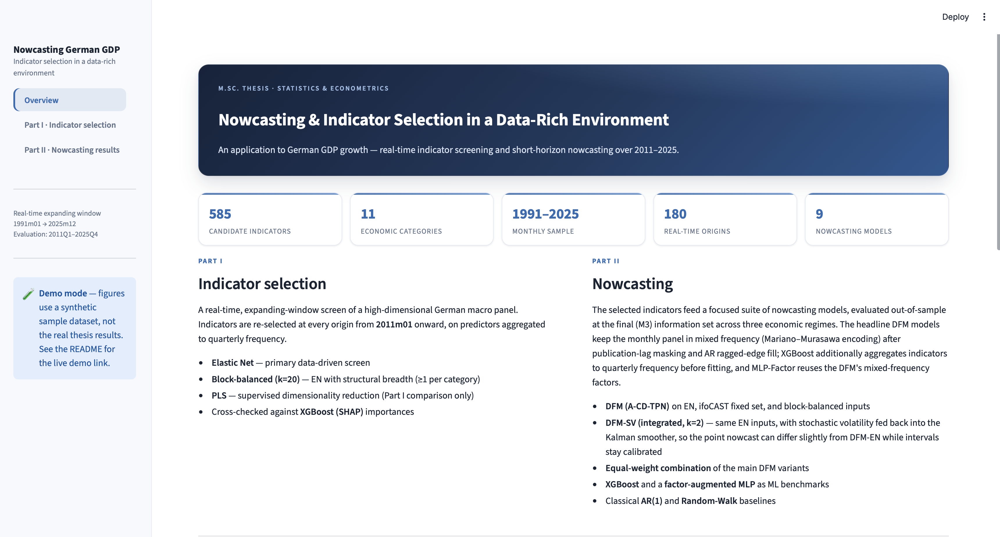
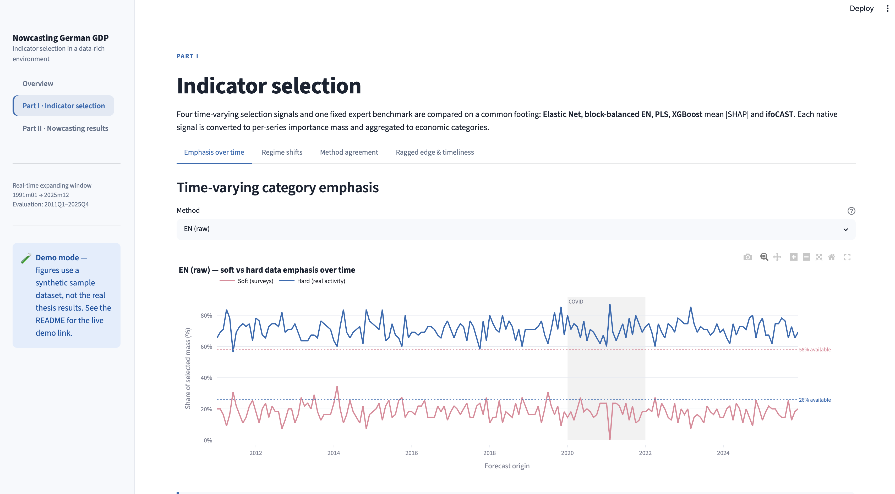
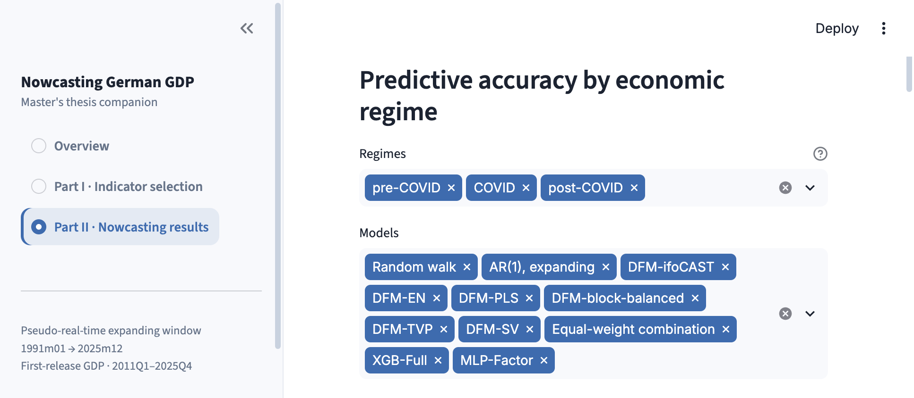
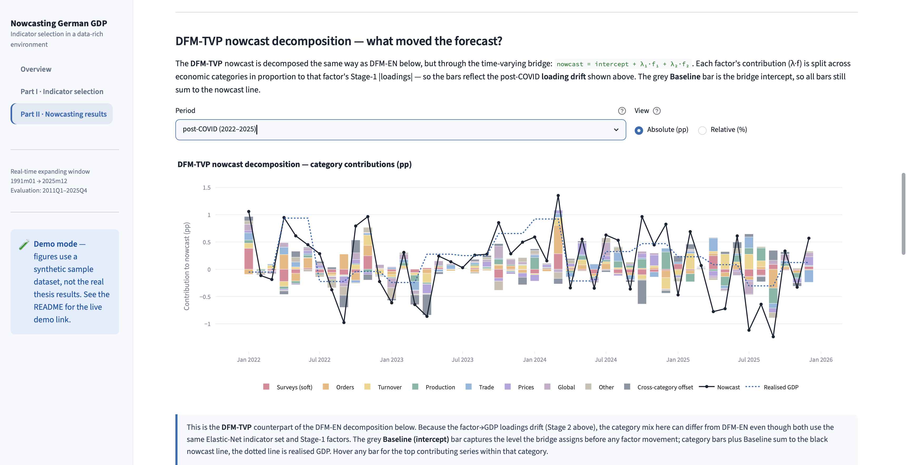
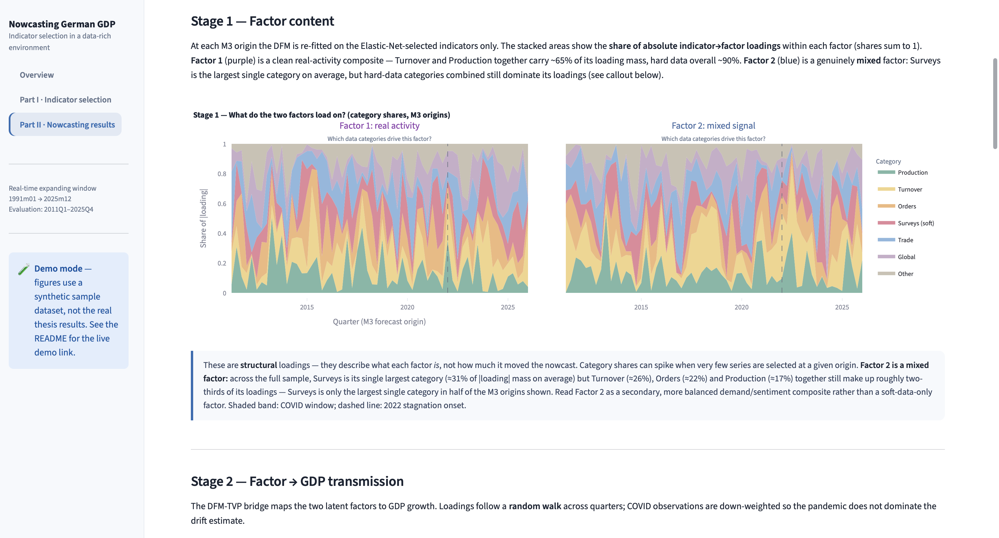

# German GDP Nowcast Dashboard

### Interactive companion to a master's thesis on real-time German GDP nowcasting

[](https://german-gdp-nowcast-dashboard.streamlit.app)
[](https://www.python.org/)
[](https://streamlit.io/)
[](https://plotly.com/python/)
[](docs/DATA.md)
[](https://github.com/Nikta-Kiani/german-gdp-nowcasting)

**[Live demo](https://german-gdp-nowcast-dashboard.streamlit.app) · [Research pipeline repo](https://github.com/Nikta-Kiani/german-gdp-nowcasting) · [Data & privacy notes](docs/DATA.md)**

> Which monthly indicators actually move a real-time German GDP nowcast, and
> which models best turn them into a forecast? This dashboard makes that
> question explorable.

---

## Executive summary

German GDP is only published well after the reference quarter ends.
**Nowcasting** fills that gap by turning ~580 higher-frequency monthly
indicators — surveys, industrial production, orders, trade, prices — into a
live estimate of current-quarter growth, updated as new data arrives.

This dashboard is the interactive front end for a master's thesis that asks
two linked questions:

1. **Indicator selection** — which of ~580 candidate monthly series carry
   real, stable predictive signal for GDP, and does that set shift across
   economic regimes (pre-COVID / COVID / post-COVID)?
2. **Nowcasting accuracy** — do models built on those data-driven indicator
   sets beat classical baselines and a fixed expert-curated panel
   (ifo's ifoCAST), and can Bayesian stochastic-volatility models keep
   forecast intervals honest through the pandemic shock?

It presents the full pipeline end to end: from a 585-series candidate panel,
through five indicator-selection methods, into eleven nowcasting models
evaluated out-of-sample over 2011–2025 — as a guided, two-part interactive
tour rather than a static PDF of tables.

## Visuals

<p align="center">
  
</p>

<p align="center">
  
  &nbsp;
  
</p>

<p align="center">
  
  &nbsp;
  
</p>

> Captured in demo mode (synthetic sample data — see the "Demo mode" banner
> in each screenshot). The **live demo** linked above runs the same UI
> against the real thesis results.

## Methodology at a glance

The dashboard visualises results from a two-part econometric pipeline
(full detail, code, and reproduction instructions live in the
[`german-gdp-nowcasting`](https://github.com/Nikta-Kiani/german-gdp-nowcasting) repository):

**Part I — Indicator selection.** At 180 monthly, expanding-window origins
(2011M1–2025M12), the panel is re-screened by:

- **Elastic Net** (ℓ₁+ℓ₂ regularised regression, 5-fold CV, COVID-aware
  down-weighting) — the primary data-driven screen;
- **Block-balanced EN** — Elastic Net constrained to keep ≥1 indicator per
  economic category, so the input set stays structurally diverse;
- **Partial Least Squares (PLS+VIP)** — a supervised dimensionality-reduction
  comparison;
- cross-checked against **XGBoost SHAP** importances (a non-linear signal) and
  the **ifoCAST** fixed expert panel (a non-data-driven benchmark).

**Part II — Nowcasting.** The selected indicator sets feed a **mixed-frequency
Dynamic Factor Model** (Mariano–Murasawa encoding, EM-Kalman estimation, 2
latent factors) with two extensions — **time-varying parameters** and
**Bayesian stochastic volatility** — plus **XGBoost** and a **factor-augmented
MLP** as machine-learning benchmarks, against classical **AR(1)** and
**Random Walk** baselines. All eleven models are evaluated out-of-sample at
the real-time information set (publication-lag masking + AR ragged-edge fill,
so no future information ever leaks into a historical forecast), using RMSFE,
Diebold–Mariano tests, Mincer–Zarnowitz regressions, and interval-coverage
diagnostics across three economic regimes (pre-COVID / COVID / post-COVID).

## Quickstart

```bash
git clone https://github.com/Nikta-Kiani/german-gdp-nowcast-dashboard.git
cd german-gdp-nowcast-dashboard

python3 -m venv .venv
source .venv/bin/activate          # Windows: .venv\Scripts\activate

pip install -r requirements.txt
streamlit run app.py
```

Opens at <http://localhost:8501>. No data setup required — the app ships with
a small **synthetic demo dataset** (schema-identical to the real results, but
every value is fabricated) so it renders immediately on a clean clone. A
"Demo mode" banner appears in the sidebar whenever it's active.

To point the dashboard at real results instead, see
[`data/README.md`](data/README.md) — either drop them into `data/real/` or
set the `DASHBOARD_DATA_DIR` environment variable.

## Why the real results aren't in this repo

The underlying source data (ifo/Macrobond licensed series) cannot be
redistributed, so neither can artefacts derived from it. This repo ships code
+ a synthetic sample only; the **live demo** linked at the top of this README
runs against the real results from a private deployment, so you can see the
actual thesis findings without any licensed data being exposed publicly. Full
rationale in [`docs/DATA.md`](docs/DATA.md).

## Repository structure

```text
german-gdp-nowcast-dashboard/
├── app.py                        # Streamlit entry point — streamlit run app.py
├── requirements.txt
├── .streamlit/
│   └── config.toml               # brand theme (colours, font)
├── src/
│   └── dashboard/
│       ├── config.py             # paths, colours, model & category registries
│       ├── data.py               # cached CSV/parquet data-access layer
│       ├── stats.py              # Diebold–Mariano / forecast-alignment utilities
│       ├── theme.py              # Plotly template + injected CSS + flow diagrams
│       ├── charts.py             # Plotly figure builders
│       └── sections/
│           ├── overview.py       # landing page
│           ├── selection.py      # Part I — indicator selection
│           └── nowcasting.py     # Part II — nowcasting results
├── data/
│   ├── README.md                 # data layout & how to point at real results
│   └── demo/                     # synthetic sample data (tracked in git)
├── scripts/
│   └── generate_demo_data.py     # regenerates data/demo/ from scratch
├── assets/
│   └── screenshots/               # dashboard screenshots / demo GIF
└── docs/
    └── DATA.md                   # data provenance & privacy notes
```

## Tech stack

- **[Streamlit](https://streamlit.io/)** — app framework
- **[Plotly](https://plotly.com/python/)** — interactive charts
- **pandas / numpy / pyarrow** — data wrangling (CSV + Parquet)
- **SciPy** — Diebold–Mariano significance testing

## Related work

- **[german-gdp-nowcasting](https://github.com/Nikta-Kiani/german-gdp-nowcasting)**
  — the full research pipeline (data prep, indicator selection, DFM/SV/TVP
  estimation, ML benchmarks, evaluation) that produces the results this
  dashboard visualises.
- *Nowcasting and Indicator Selection in a Data-Rich Environment: An
  Application to German GDP Growth* — the accompanying master's thesis.

## Citation

If this dashboard or the underlying pipeline supports your research, please
cite the accompanying master's thesis (see the
[research repository](https://github.com/Nikta-Kiani/german-gdp-nowcasting)
for full citation details).
